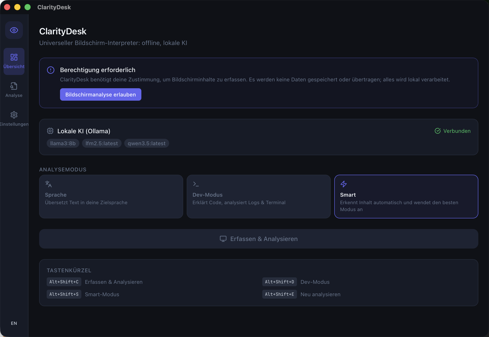

<div align="center">
  

  <h1>ClarityDesk</h1>
</div>

[🇬🇧 English Version](README.md)

**Universeller Display-Interpreter mit OCR und lokaler KI. Bewusst offline, damit Bildschirminhalte das Gerät nie verlassen. Entwickelt mit Rust und Tauri.**

ClarityDesk erfasst deinen Bildschirm, extrahiert Text per OCR und analysiert ihn mit einem lokalen KI-Modell: Übersetzung, Code-Erklärung, Log-Analyse und Terminal-Diagnose; ohne Cloud, ohne Datenspeicherung, ohne Account.

[](https://github.com/9t29zhmwdh-coder/ClarityDesk/actions)      

> **So läuft es:** ClarityDesk ist eine native Desktop-App, kein Server oder Browser-Tool. Sie öffnet sich als eigenes Fenster, ohne Tray-Icon oder Hintergrunddienst; sie erfasst und analysiert deinen Bildschirm nur, wenn du sie aktiv auslöst.



**In der Praxis:** du erteilst einmal die Zustimmung zur Bildschirmerfassung, löst dann per Hotkey oder Button eine Erfassung aus; ClarityDesk extrahiert den Text per OCR und zeigt eine übersetzte, erklärte oder diagnostizierte Version neben dem Original. Alles läuft lokal über Ollama; nichts wird irgendwohin gesendet oder auf die Festplatte geschrieben.

---

> 🌱 Neu hier? → [Schritt-für-Schritt-Anleitung für Einsteiger](GETTING_STARTED.md)

---

## Funktionen

| Funktion | Beschreibung |
|---|---|
| **Display-Erfassung** | Vollbild, aktives Fenster oder benutzerdefinierte Region erfassen |
| **OCR-Extraktion** | Tesseract-basierte Textextraktion mit Layout-Erkennung |
| **Sprach-Modus** | Beliebigen sichtbaren Text in die Zielsprache übersetzen |
| **Dev-Modus** | Code erklären, Logs analysieren, Terminal-Output diagnostizieren |
| **Smart-Modus** | Erkennt Inhaltstyp automatisch und wendet den besten Modus an |
| **Block-Klassifizierung** | Identifiziert Code, Terminal, Log, Absatz, Tabelle, UI-Blöcke |
| **Lokale KI (Ollama)** | Läuft mit Llama, Mistral, CodeLlama oder jedem kompatiblen Modell |
| **App-Profile** | Anwendungsspezifische Modus-Voreinstellungen (VS Code → Dev, Browser → Sprache) |
| **Privacy-First** | Keine Cloud, keine Speicherung, keine Telemetrie: nur RAM-Verarbeitung |
| **Hotkeys** | Systemweite Kurzbefehle für Erfassung und Moduswechsel |
| **Side-Panel** | Original- vs. Analyse-Ansicht mit Kopierfunktion |

---

## Voraussetzungen

- [Rust](https://rustup.rs/) 1.77+
- [Node.js](https://nodejs.org/) 20+
- [Tauri CLI v2](https://tauri.app/): `cargo install tauri-cli`
- [Ollama](https://ollama.ai) mit mindestens einem Modell (`ollama pull llama3.2`)
- [Tesseract OCR](https://tesseract-ocr.github.io/tessdoc/Installation.html) (`brew install tesseract` auf macOS)
- macOS 12+ / Windows 10+ / Linux (Wayland oder X11)

**macOS:** *Bildschirmaufnahme*-Berechtigung in Systemeinstellungen → Datenschutz & Sicherheit erteilen.

---

## Schnellstart

```bash
git clone https://github.com/9t29zhmwdh-coder/ClarityDesk
cd ClarityDesk

# Frontend-Abhängigkeiten installieren
cd frontend && npm install && cd ..

# Entwicklungsmodus starten
cargo tauri dev

# Produktions-Build erstellen
cargo tauri build
```

**CLI-Nutzung:**
```bash
# Bildschirm erfassen und analysieren
cargo run -p cd-cli -- capture --mode smart --lang Deutsch

# Text übersetzen
cargo run -p cd-cli -- translate "Hello, world" --lang Deutsch

# Ollama-Verbindung prüfen
cargo run -p cd-cli -- status
```

---

## Deinstallation / Aufräumen

ClarityDesk hält Einstellungen nur im Arbeitsspeicher; zwischen den Läufen wird nichts auf die Festplatte geschrieben, Entfernen ist also nur das Löschen der App selbst:

- **macOS:** App-Bundle löschen (oder Build-Output aufräumen: `rm -rf target/`)
- **Windows:** Deinstallation über Einstellungen → Apps, oder Build-Output-Ordner löschen

Es bleiben keine Konfigurationsdateien, Caches oder Registry-Einträge zurück.

---

## Datenschutz

ClarityDesk basiert auf expliziter Nutzerfreigabe:

- Kein Bildschirminhalt wird gespeichert, protokolliert oder übertragen
- Alle OCR-Verarbeitung erfolgt lokal via Tesseract
- Alle KI-Analysen erfolgen lokal via Ollama
- Beim ersten Start erscheint ein Einwilligungs-Dialog
- Eine App-Whitelist kann einschränken, welche Anwendungen ClarityDesk analysieren darf
- Alles wird im RAM verarbeitet und sofort nach der Anzeige verworfen

---

## Architektur

```
ClarityDesk/
├── crates/
│   ├── cd-core/             # Core-Engine: Capture, OCR, Analyzer, Semantic
│   │   ├── capture/         # Plattform-Bildschirmerfassung (screenshots-Crate)
│   │   ├── ocr/             # Tesseract OCR + HOCR-Block-Parser
│   │   ├── analyzer/        # Inhalts-Klassifikation (Code/Terminal/Log/Text)
│   │   └── semantic/        # Ollama REST-Client + Prompt-Vorlagen
│   └── cd-cli/              # CLI-Tool (capture, translate, status)
├── src-tauri/               # Tauri v2 Desktop-Shell + IPC-Commands
├── frontend/                # React + TypeScript + Tailwind UI
│   └── src/components/
│       ├── Dashboard/       # Modus-Auswahl, Capture-Trigger, Ollama-Status
│       ├── Analysis/        # Block-Viewer, Original/Analysiert-Umschalter
│       └── Settings/        # Ollama, OCR, Hotkeys, Datenschutz-Konfiguration
└── config/
    ├── app-profiles/        # App-spezifische JSON-Voreinstellungen
    └── model-config.toml    # Modell- und Sprach-Standardwerte
```

---

**Autor:** [Rafael Yilmaz](https://github.com/9t29zhmwdh-coder) · **Status:** Active ·  · **Lizenz:** MIT
