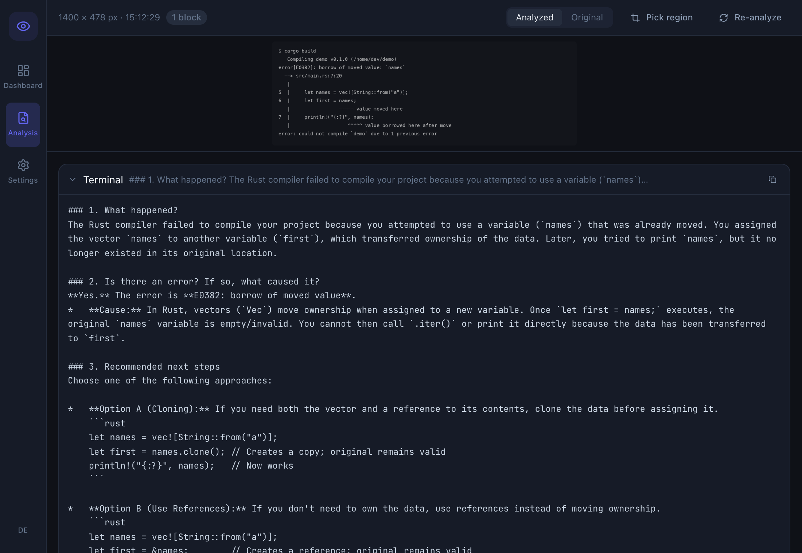

<div align="center">
  

  <h1>ClarityDesk</h1>
</div>

[🇩🇪 Deutsche Version](README.de.md)

**Explains whatever is on your screen, without that screen ever leaving your machine.**

A stack trace in a language you do not read. A config dialog in a VM with no
clipboard. An error in a screenshot someone pasted into a chat. In every case
the text is right in front of you and unreachable: you cannot select it, so you
cannot paste it into anything that would explain it.

ClarityDesk grabs the region, reads it with OCR, and shows the translation, the
explanation or the diagnosis next to the original. Hotkey or button, and that
is the whole interaction.

It runs against a local Ollama model. Nothing is uploaded, and captures and
results are never written to disk, which is the point when the thing on screen
is a customer system or a production log.

**Not for you if** the text is selectable. Copy it and paste it into whatever
model you already use; OCR only adds a chance to misread it.

[](https://github.com/9t29zhmwdh-coder/ClarityDesk/actions) [](https://github.com/9t29zhmwdh-coder/ClarityDesk/security/code-scanning) [](https://securityscorecards.dev/viewer/?uri=github.com/9t29zhmwdh-coder/ClarityDesk) [](https://www.bestpractices.dev/projects/13715)

     

> **How it runs:** ClarityDesk is a native desktop app, not a server or browser tool. It opens as its own window and has no tray icon or background service; it only captures and analyzes your screen while you actively trigger it.



---

> 💾 **Download:** [macOS (DMG)](https://github.com/9t29zhmwdh-coder/ClarityDesk/releases/latest/download/ClarityDesk.dmg) · [Windows (Installer)](https://github.com/9t29zhmwdh-coder/ClarityDesk/releases/latest/download/ClarityDesk-Setup.exe) · [Linux (AppImage)](https://github.com/9t29zhmwdh-coder/ClarityDesk/releases/latest/download/ClarityDesk.AppImage): always the latest release, not code-signed/notarized (Gatekeeper/SmartScreen will warn on first run). Or build from source, see Getting Started below.

---

ClarityDesk's UI is available in English (default) and German; switch anytime with the language toggle.

**In practice:** you grant screen capture consent once, then trigger a capture via hotkey or button; ClarityDesk extracts the text with OCR and shows a translated, explained or diagnosed version side-by-side with the original. Everything runs locally through Ollama; captures and results stay in memory and are gone when the app closes.

---

> 🌱 New here? → [Step-by-step guide for beginners](GETTING_STARTED.md)

---

## Features

| Feature | Description |
|---|---|
| **Capture button** | Hides ClarityDesk, captures the primary screen, comes back with the result |
| **Hotkeys** | System-wide: capture the window in front, from any app, and bring the explanation forward |
| **Region** | Drag a rectangle over the capture to read only that part |
| **OCR** | Tesseract, lines and layout kept; uses the installed languages of those configured |
| **Language mode** | Translates the text into your target language |
| **Dev mode** | Explains a command, its code and its error as one story |
| **Smart mode** | Decides between the two from what the capture contains |
| **App profiles** | A hotkey capture picks its mode from the app in front: browsers translate, terminals and code editors explain; add your own as JSON |
| **Local AI (Ollama)** | Default model `qwen3.5:4b-mlx` on a Mac (`qwen3.5:4b` elsewhere), any Ollama model works |
| **Answer language** | Translations and explanations come in the target language you set |
| **Settings** | Saved between runs; captures and results are not |
| **CLI** | `claritydesk image <file>` explains a screenshot you already have |

---

## Requirements

- [Ollama](https://ollama.com) with a model: `ollama pull qwen3.5:4b-mlx` on a Mac, `ollama pull qwen3.5:4b` elsewhere. It needs about 4.5 GB of memory while it answers.
- [Tesseract OCR](https://tesseract-ocr.github.io/tessdoc/Installation.html) with the languages you read: `brew install tesseract tesseract-lang` on macOS. Plain `brew install tesseract` has English only.
- macOS 12+ / Windows 10+ / Linux (Wayland or X11)
- To build from source: [Rust](https://rustup.rs/), [Node.js](https://nodejs.org/) 20+, and the Tauri CLI (`npx @tauri-apps/cli@2` works without installing it)

**macOS:** Grant *Screen Recording* permission in System Settings → Privacy & Security.

---

## Quick Start

```bash
git clone https://github.com/9t29zhmwdh-coder/ClarityDesk
cd ClarityDesk

# Install frontend dependencies
cd frontend && npm install && cd ..

# Run in development mode
cargo tauri dev

# Build for production
cargo tauri build
```

**CLI usage:**
```bash
# Explain a screenshot you already have (PNG or JPEG), answer in German
cargo run -p cd-cli -- image error.png --lang Deutsch

# Capture the primary screen and analyze it
cargo run -p cd-cli -- capture --mode smart

# Translate a text string
cargo run -p cd-cli -- translate "Hello, world" --lang Deutsch

# Check Ollama and whether the model is installed
cargo run -p cd-cli -- status
```

---

## Uninstall / Cleanup

ClarityDesk writes one settings file and nothing else. Remove the app, then its folder:

- **macOS:** delete the app bundle (or run `cargo tauri build` output cleanup: `rm -rf target/`)
- **Windows:** uninstall via Settings → Apps, or delete the build output folder

- **Settings:** `~/Library/Application Support/ch.raystudio.claritydesk` (macOS), `%APPDATA%\ch.raystudio.claritydesk` (Windows), `~/.config/ch.raystudio.claritydesk` (Linux). Own app profiles live in its `profiles` folder.
- **Screen Recording** permission (macOS): remove ClarityDesk in System Settings, Privacy & Security.
- The Ollama model: `ollama rm qwen3.5:4b-mlx`, if nothing else uses it.

---

## Privacy

- Captures and results stay in memory and are gone when ClarityDesk closes. Tesseract reads the image from a pipe, not from a file.
- Only the settings are saved (Ollama address and model, languages, hotkeys, whether consent was given).
- OCR runs locally via Tesseract; the text goes to the Ollama address in the settings, which is this computer unless you change it.
- The capture button asks for consent once; hotkeys only run when you press them.
- The page inside the app can call nothing but ClarityDesk's own commands; it has no file access.

---

## Architecture

```
ClarityDesk/
├── crates/
│   ├── cd-core/             # Core engine: capture, OCR, analyzer, semantic
│   │   ├── capture/         # Screen, focused window, crop (xcap crate)
│   │   ├── ocr/             # Tesseract via pipes, hOCR parser, block classifier
│   │   ├── analyzer/        # Mode inference, grouping blocks into prompts
│   │   ├── semantic/        # Ollama client + prompt templates
│   │   └── profiles.rs      # App profiles: app name to mode
│   └── cd-cli/              # CLI tool (capture, image, translate, status)
├── src-tauri/               # Tauri v2 shell, IPC commands, global hotkeys
├── frontend/                # React + TypeScript + Tailwind UI
│   └── src/components/
│       ├── Dashboard/       # Mode selector, capture trigger, Ollama status
│       ├── Analysis/        # Block viewer, original/analyzed toggle, region picker
│       └── Settings/        # Ollama, OCR, hotkeys, privacy config
└── config/
    └── app-profiles/        # Built-in app profiles, compiled into the app
```

---

**Author:** [Rafael Yilmaz](https://github.com/9t29zhmwdh-coder) · **Status:** Active ·  · **License:** MIT
